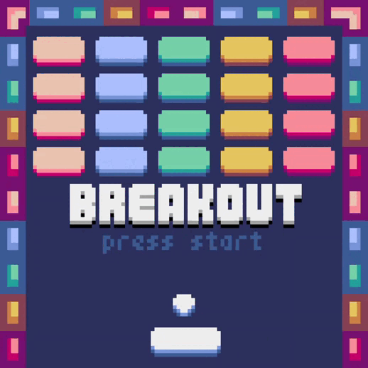

## Sobre o projeto
🚧⚠️Em desenvolvimento...⚠️🚧

Criando clone do game retro "Breakout"
Criado através da linguagem python, utilizando a interface gráfica da game engine Pyxel.

## Requerimentos
  - Python
  - Pyxel
    
## Resultado
  

    
   
  

